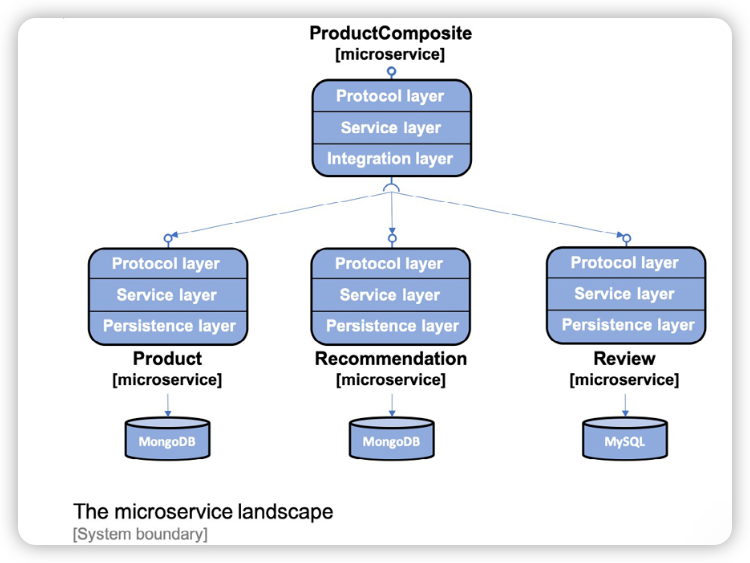

# Persistence

We will use the Spring DATA project to persist data to MongoDB and MySQL databases.

The `product` and `recommendation` microservices will use Spring Data for MongoDB and 
the `review` microservice will use Spring Data for the JPA to access MySQL.


Objective:
1. Adding a persistence layer to the core microservices
2. Writing automated tests that focus on persistence
3. Using the persistence layer in the service layer 
4. Adding databases to the Docker Compose landscape
5. Manual testing of the new APIs and the persistence layer
6. Updating the automated tests of the microservice landscape


To access the databases manually, we will use the CLI tools provided in the Docker images
used to run the databases. We will also expose the standard ports used for each database
in Docker Compose, `3306` for MySQL and `27017` for MongoDB. 



The protocol layer handles **protocol-specific** logic. It's very thin, only consisting of the 
`RestController` annotation in the `api` project and the common `GlobalControllerExceptionHandler` 
in the `util` project.

The main functionality of each microservice resides in the **Service layers**. The 
`product-composite` service contains an **Integration layer** used to handle the communication
with the three core microservices. The core microservices will all have a **Persistence layer**
used for communicating with their databases.

## Adding a persistence layer to the core microservices 

We will use a Java bean mapping tool,**MapStruct**, that makes it easy to transform 
between Spring Data entity objects and the API model classes.


```groovy
// Adding MapStruct dependency 
ext {
  mapstructVersion = "1.3.1"
}

implementation "org.mapstruct:mapstruct:${mapstructVersion}"

// MapStruct generates the implementation of the bean mappings at compile time by 
// processing MapStruct annotations, we need to add below dependencies
annotationProcessor "org.mapstruct:mapstruct-processor:${mapstructVersion}"
testAnnotationProcessor "org.mapstruct:mapstruct-processor:${mapstructVersion}"

//To make the compile-time generation work in popular IDEs such as IntelliJ IDEA,
//we also need to add the following dependency
compileOnly "org.mapstruct:mapstruct-processor:${mapstructVersion}"

// Add for `product` and `recommendation` microservices, to access MongoDB
implementation 'org.springframework.boot:spring-boot-starter-data-mongodb'

// Add for `review` microservice, Spring JPA and JDBC driver for MySQL
implementation 'org.springframework.boot:spring-boot-starter-data-jpa'
implementation 'mysql:mysql-connector-java'

// Add for `product` and `recommendation` microservices
// To enable the use of MongoDB and MySQL when running automated integration tests,
// we will use `Testcontainers` and its support for JUnit5, MongoDB, and MySQL.
implementation platform('org.testcontainers:testcontainers-bom:1.16.2')
testImplementation 'org.testcontainers:testcontainers'
testImplementation 'org.testcontainers:junit-jupiter'
testImplementation 'org.testcontainers:mongodb'

// Add for `review` microservices
implementation platform('org.testcontainers:testcontainers-bom:1.16.2')
testImplementation 'org.testcontainers:testcontainers'
testImplementation 'org.testcontainers:junit-jupiter'
testImplementation 'org.testcontainers:mysql'

```

```java
//@Document annotation is used to mark the class as an entity class used for MongoDB,
//that is, mapped to a collection in MongoDB with the anem `products`
@Document(collection="products")
public class ProductEntity {

/**
 * The `id` field is used to hold the database identity of each stored entity,
 * corresponding to the primary key when using a relational database.
 * 
 * The `id` field is not exposed in the API, as a best practice from a security 
 * perspective. The fields in the model classes that identify an entity will be 
 * assigned a unique index in the corresponding entity class, to ensure 
 * consistency in the database from a business perspective.
 */
 @Id
 private String id;

/**
 * The `version` field is used to implement optimistic locking, allowing 
 * Spring Data to verify that updates of an entity in the database do not 
 * overwrite a concurrent update. If the value of the `version` field stored
 * in the database is higher than the value of the `version` field in an update
 * request, it indicates that the update is performed on stale data - the information
 * to be updated has been updated by someone else it was read from the database.
 * 
 * Attempts to perform updates based on stale data will be prevented by Spring Data.
 * Since we only implement APIs for create, read, and delete operations, we will, however,
 * not expose the `version` field in the API.
 */
 @Version
 private Integer version;

// @Indexed(unique = true) annotation is used to get a unique index created for the business key,  productId.
 @Indexed(unique = true)
 private int productId;

 private String name;
 private int weight;


```


```java
@Document(collection="recommendations")
/**
 * @CompoundIndex annotation for the compound business key based on the `productId` and `recommendationId` fields.
 */
@CompoundIndex(name = "prod-rec-id", unique = true, def = "{'productId': 1, 'recommendationId' : 1}")
public class RecommendationEntity {

    @Id
    private String id;

    @Version
    private Integer version;

    private int productId;
    private int recommendationId;
    private String author;
    private int rating;
    private String content;

```

```java
/**
 * @Entity and @Table annotations are used to mark the class as an entity class used for JPA
 * -- mapped to a table in a SQL database with the name `reviews`
 * 
 * @Table annotation is also used to specify that a unique compound index will be created for 
 * the compound business key based on the `productId` and `reviewId` fields.
 * 
 * 
 */
@Entity
@Table(name = "reviews", indexes = { @Index(name = "reviews_unique_idx", unique = true, columnList = "productId,reviewId") })
public class ReviewEntity {
    
//    @GeneratedValue is used to direct Spring JPA to automatically generate unique `id` values.
    @Id @GeneratedValue
    private int id;

    @Version
    private int version;

    private int productId;
    private int reviewId;
    private String author;
    private String subject;
    private String content;

```

[Spring JPA Rerence](https://docs.spring.io/spring-data/data-commons/docs/current/reference/html/#repositories.query-methods.query-creation)

```java

public interface ReviewRepository extends CrudRepository<ReviewEntity, Integer> {
//    Since SQL databases are transactional, we have to specify the default transaction type, 
//    read-only in our case, for the query method.
    @Transactional(readOnly = true)
    List<ReviewEntity> findByProductId(int productId);
}

```

## Writing automated tests that focus on persistence 

When writing persistence tests, we want to start a database when the tests begin and tear it down when 
the tests complete. However, we don't want the tests to wait for other resources to start up, for example,
a web server such as Netty(which is required at runtime).

Spring Boot comes with two class-level annotation tailored for this specific requirement:
1. @DataMongoTest: This annotation starts up a MongoDB database when the test starts.
2. @DataJpaTest: This annotation starts up a SQL database when the test starts.

Note: By default, Spring Boot configures the tests to rollback updates to the SQL database to minimize 
the risk of negative side effects on the other tests. In our case, this behavior will cause some tests
to fail. Therefore, automatic rollback is disabled with the class level annotation
`@Transactional(propagation = NOT_SUPPORTED)`

To handle the startup and tear down of databases during the execution of the integration tests, we will 
use `Testcontainers`.


### Testcontainers

[Testcontainers](https://www.testcontainers.org/) is a library that simplifies running automated integration
tests by running resource managers like a database or a message broker as a Docker container. 

Testcontainers can be configured to automatically start up Docker containers when JUnit tests are started
and tear down the containers when the tests are complete.

```java
/**
 * A disadvantage of this approach is that each test class will use its own Docker container.
 * Bringing up MySQL in a Docker container takes a few seconds. Running multiple test classes
 * that use the same type of test container will add this latency for each test class. To avoid
 * this extra latency, we can use the `Single Container Pattern` .
 * https://www.testcontainers.org/test_framework_integration/manual_lifecycle_control/#singleton-containers
 */

//@Testcontainers  enable Testcontainers
@SpringBootTest
@Testcontainers
class SampleTests {
//    @Container declare a MySQL container
//    We should use the same version of MySQL as we use in dev/uat/prod, to keep consistency.
    @Container
    private static MySQLContainer database =
            new MySQLContainer("mysql:5.7.32");
}
```

```java
// Single Container Pattern
public abstract class MySqlTestBase {

    private static MySQLContainer database =
            new MySQLContainer("mysql:5.7.32");

//    static block is used to start the database before any JUnit code is invoked.
    static {
        database.start();
    }

//      @DynamicPropertySource is to override the database configuration in the application context.
//    here is get configuration from application.yml file
    @DynamicPropertySource
    static void databaseProperties(DynamicPropertyRegistry registry) {
        registry.add("spring.datasource.url", database::getJdbcUrl);
        registry.add("spring.datasource.username", database::getUsername);
        registry.add("spring.datasource.password", database::getPassword);
    }
}
```


By default, the log output from Testcontainers is rather extensive. A Logback configration file can be 
placed in the `src/test/resources` folder to limit the amount of log output. Logback is a
[logging framework](http://logback.qos.ch), and it's included in the microservices by using the 
`spring-boot-starter-webflux` dependency. For details, see [logging_config](https://www.testcontainers.org/supported_docker_environment/logging_config/)

```xml
<?xml version="1.0" encoding="UTF-8" ?>
<!--src/test/resources/logback-test.xml-->
<configuration>
<!--    includes two config files -->
    <include resource="org/springframework/boot/logging/logback/defaults.xml"/>
    <include resource="org/springframework/boot/logging/logback/console-appender.xml"/>

<!--    limits log output to the INFO log level, discarding DEBUG and TRACE log records emitted by the Testcontainers library-->
    <root level="INFO">
<!--        write log to the console -->
        <appender-ref ref="CONSOLE"/>
    </root>
</configuration>
```

Finally, when using `@DataMongoTest` and `@DataJpaTest` annotations instead of the `@SpringBootTest`
annotation to only start up the MongoDB and SQL database during the integration test, there is one 
more thing to consider. The `@DataMongoTest` and `@DataJpaTest` annotations are designed to start
an embedded databased by default. Since we want to use a containerized database, we have to disable
this feature. 

```java
//For the @DataJpaTest annotation, this can be done by using a @AutoConfigureTestDatabase annotation like below.
@DataJpaTest
@AutoConfigureTestDatabase(replace = AutoConfigureTestDatabase.Replace.NONE)
class PersistenceTests extends MySqlTestBase {
}
```
```java
// For the @DataMongoTest annotation, this can be done by using `excludeAutoConfiguration`
@DataMongoTest(
  excludeAutoConfiguration = EmbeddedMongoAutoConfiguration.class)
class PersistenceTests extends MongoDbTestBase {
}
```


## Logging the database connection URL 

When scaling up the number of microservices where each microservice connects to its own database,
it can be hard to keep track of what database each microservice actually uses. To avoid this confusion,
a good practice is to add a log statement directly after the startup of a microservice that logs 
connection information that is used to connect to the database.

```java
public class ProductServiceApplication {
  private static final Logger LOG = 
  LoggerFactory.getLogger(ProductServiceApplication.class);

  public static void main(String[] args) {
    ConfigurableApplicationContext ctx = 
    SpringApplication.run(ProductServiceApplication.class, args);
    String mongodDbHost = 
    ctx.getEnvironment().getProperty("spring.data.mongodb.host");
    String mongodDbPort = 
    ctx.getEnvironment().getProperty("spring.data.mongodb.port");
    LOG.info("Connected to MongoDb: " + mongodDbHost + ":" + 
    mongodDbPort);
  }
}

```

## Adding databases to the Docker Compose landscape 

We will bring MongoDb and MySQL into the system landscape controlled by Docker Compose and 
add configuration to our microservice so that they can find their databases when running.

```yaml
mongodb:
  image: mongo:4.4.2
  mem_limit: 512m
  ports:
    - "27017:27017"
  command: mongod
  healthcheck:
    test: "mongo --eval 'db.stats().ok'"
    interval: 5s
    timeout: 2s
    retries: 60

mysql:
  image: mysql：5.7.32
  mem.limit: 512m
  ports:
    - "3306:3306"
  environment:
    - MYSQL_ROOT_PASSWORD=rootpwd
    - MYSQL_DATABASE=review-db
    - MYSQL_USER=user
    - MYSQL_PASSWORD=pwd
  healthcheck:
    test: "/usr/bin/mysql --user=user --password=pwd --execute \"SHOW DATABASES;\""
    interval: 5s
    timeout: 2s
    retries: 60
```

To avoid problems with microservices that ry to connect to their databases before the database 
is up and running, the `product` and `recommendation` services are declared dependent on the 
MongoDB and MySQL as follows:
```yaml
depends_on:
  mongodb:
    condition: service_healthy

depends_on:
  mysql:
    condition: service_healthy
```

The next is to configure the microservices to connect to database, as follows in yaml file.
```yaml
spring.data.mongodb:
  host: localhost
  port: 27017
  database: product-db

logging:
 level:
 org.springframework.data.mongodb.core.MongoTemplate: DEBUG

---

spring.config.activate.on-profile: docker

spring.data.mongodb.host: mongodb

```

1. When running without Docker using the default Spring profile, the database is expected to be reachable on localhost:27017
2. Setting the log level for MongoTemplate to DEBUG will allow us to see which MongoDB statement are executed in the log
3. When running inside Docker using the Spring profile, docker, the database is expected to be reachable on mongodb:27017

The following configuration is for MySQL:

```yaml
spring.jpa.hibernate.ddl-auto: update

spring.datasource:
  url: jdbc:mysql://localhost/review-db
  username: user
  password: pwd

spring.datasource.hikari.initializationFailTimeout: 60000

logging:
 level:
 org.hibernate.SQL: DEBUG
 org.hibernate.type.descriptor.sql.BasicBinder: TRACE

---
spring.config.activate.on-profile: docker

spring.datasource:
 url: jdbc:mysql://mysql/review-db
```

1. By default, Hibernate will be used by Spring Data JPA as the JPA Entity Manager
2. The `spring.jpa.hibernate.ddl-auto` property is used to tell Spring JPA to create new or update existing SQL tables during startup.(this is highly recommended to disable in production)
3. When running without Docker, using the default Spring profile, the database is expected to be reachable on localhost:3306
4. By default, HikariCP is used by Spring Data JPA as the JDBC connection pool. To minimize startup problems on computers with limited hardware resources, the `initializationFailTimeout` parameter is set to 60 seconds. This means that the Spring Boot application will wait for up to 60 seconds during startup to establish a database connection.
5. The log level settings for Hibernate will cause Hibernate to print the SQL statement used and the actual values used. In production, writing the actual value should be avoided for privacy reason.
6. When running inside Docker using the Spring profile, docker, the database is expected to be reachable on the mysql:3306

## The MongoDB and MySQL CLI tools

```shell
# Start MongoDB CLI tool
docker-compose exec mongodb mongo ––quiet
>

# Start MySQL CLI tool
docker-compose exec mysql mysql -uuser -p review-db
mysql>

# Look up content in the `product` service
docker-compose exec mongodb mongo product-db --quiet --eval "db.products.find()"

# Look up content in the 'recommendation` service 
docker-compose exec mongodb mongo recommendation-db --quiet --eval "db.recommendations.find()"

# Look up content in the 'review' service 
docker-compose exec mysql mysql -uuser -p review-db -e "select * from reviews"

```

