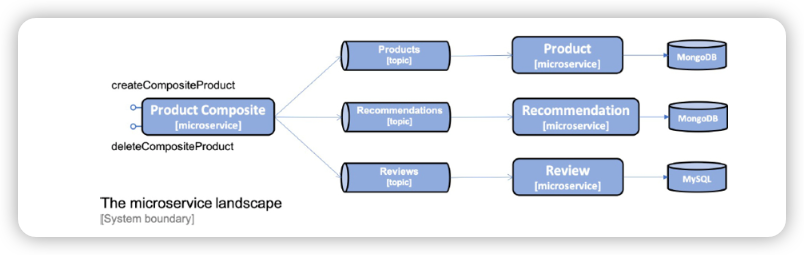
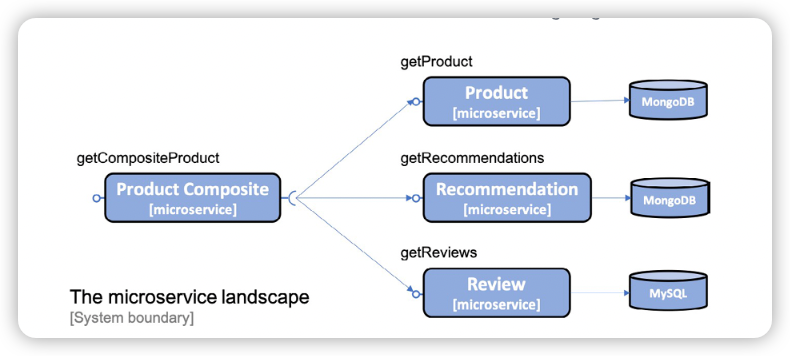
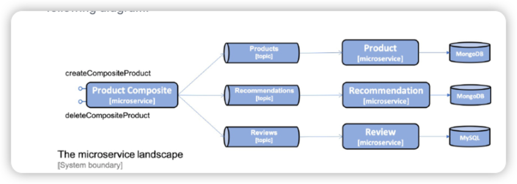
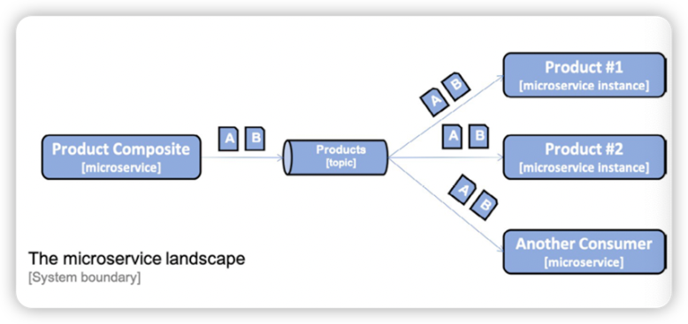
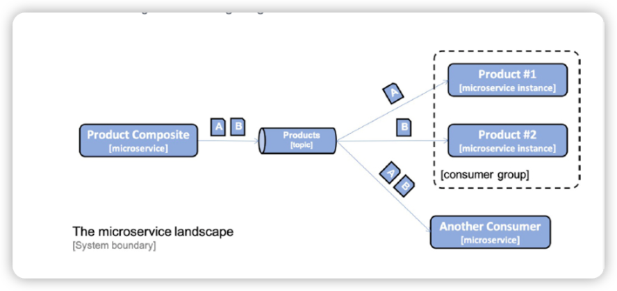
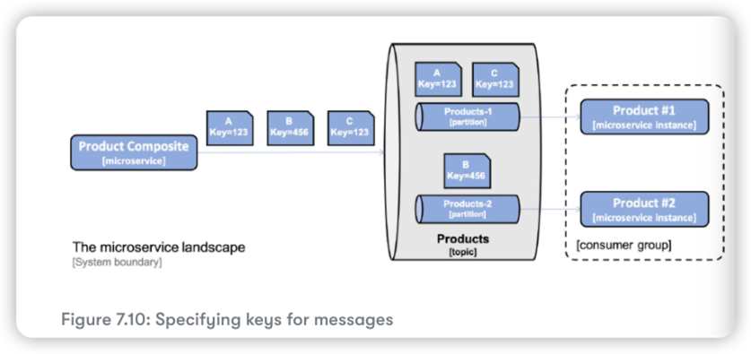

# Developing Reactive Microservice 

The foundation for reactive system is that they are message-driven - they use asynchronous 
communication. This enables them to be elastic, in other words, scalable and resilient, meaning 
that they will be tolerant of failures. Elasticity and resilience together will enable a ractive 
system to be responsive.

Objective:
1. Choosing between non-blocking synchronous APIs and event-driven asynchronous services 
2. Developing non-blocking synchronous REST APIs
3. Developing event-driven asynchronous services
4. Running manual tests of the reactive microservice landscape 
5. Running automated tests of the reactive microservice landscape 


We will:
* The create, read, and delete services exposed by the product composite microservice will be based on non-blocking synchronous APIs. The composite microservice is assumed to have clients on both web and mobile platforms, as well as clients coming from other organizations rather than the ones that operate the system landscape. Therefore, synchronous APIs seem like a natural match.
* The read services provided by the core microservices will also be developed as non-blocking synchronous APIs since there is an en user waiting for their responses.
* The create and delete services provided by the core microservices will be developed as event-driven asynchronous services, meaning that they will listen for create and delete events on topics dedicated to each microservice
* The synchronous APIs provided by the composite microservices to create and delete aggregated product information will publish create and delete events on these topics. If the publish operation succeeds, it will return with a 202(Accepted) response, otherwise an error response will be returned. The 202 response differs from a normal 200(OK) response - it indicates that the request has been accepted, but not fully processed. Instead, the processing will be completed asynchronously and independently of the 202 response.




## Developing non-blocking synchronous REST APIs

The composite service will make reactive, that is, non-blocking, calls in parallel to the three core services.
When the composite service has received responses from all of the core services, it will create a composite 
response and send it back to the caller. 



[Reactive Streams specification](http://www.reactive-streams.org/): Project Reactor is based on the Reactive Stream specification, a standard for building reactive applications.


[Project Reactor](https://projectreactor.io/): a standard for building reactive applications. Project Reactor is fundamental - it is what Spring WebFlux, Spring WebClient, and Spring Data rely on to provide their reactive and non-blocking features


The programming model is based on processing streams of data, and the core data types in Project Reactor and `Flux` and `Mono`.
A `Flux` object is used to process a stream of 0...n elements and a `Mono` object is used to process a stream that either is empty or return at most one element.

```java
@Test
void testFlux() {

  List<Integer> list = Flux.just(1, 2, 3, 4)
    .filter(n -> n % 2 == 0)
    .map(n -> n * 2)
    .log()
    .collectList().block(); // collect all items from the stream into a List

  assertThat(list).containsExactly(4, 8);
}

        Non-blocking REST APIs in the core services ---> TBC...


// change on the unit test for product service
/**
 * Since our persistence methods now return a `Mono` or `Flux` object, 
 * the test method have to wait for the response to tbe available in the returned 
 * objects. The test methods can either use an explicit call to the `block()` method
 * on the `Mono`/`Flux` object to wait unit a response is available, or they can 
 * use the `StepVerifier` helper class from Project Reactor to declare a verifiable 
 * sequence of asychronous events.
 * 
 * 
 */
// block() method
ProductEntity foundEntity = repository.findById(newEntity.getId()).block();
assertEqualsProduct(newEntity, foundEntity);

// Stepverifier 
StepVerifier.create(repository.findById(newEntity.getId()))
.expectNextMatches(foundEntity -> areProductEqual(newEntity, foundEntity))
.verifyComplete();

```


## Non-blocking REST APIs in the core services

Objective:
* Change the APIs so that they only return reactive data types
* Change the service implementation so they don't contain any blocking code 
* Change our tests so that they can test the reactive services 
* Deal with blocking code - isolate the code that still needs to be blocking from the non-blocking code


```java
Mono<Product> getProduct(@PathVariable int productId);

public Mono<Product> getProduct(int productId) {

        if (productId < 1) {
        throw new InvalidInputException("Invalid productId: " + productId);
        }

        return repository.findByProductId(productId)
        .switchIfEmpty(Mono.error(new NotFoundException("No product found
        for productId: " + productId)))
        .log(LOG.getName(), FINE)
        .map(e -> mapper.entityToApi(e))
        .map(e -> setServiceAddress(e));
        }

```


```java
/**
 * To be able to call the three APIS in parallel, the service implementation uses the static zip() method
 * on `Mono` class. The `zip` method is capable of handling a number of parallel reactive requests and 
 * zipping them together once they all are complete.
 */
@Override
public Mono<ProductAggregate> getProduct(int productId) {
  return Mono.zip(
    
    values -> createProductAggregate(
      (Product) values[0], 
      (List<Recommendation>) values[1], 
      (List<Review>) values[2], 
      serviceUtil.getServiceAddress()),
      
    integration.getProduct(productId),
    integration.getRecommendations(productId).collectList(),
    integration.getReviews(productId).collectList())
      
    .doOnError(ex -> 
      LOG.warn("getCompositeProduct failed: {}", 
      ex.toString()))
    .log(LOG.getName(), FINE);
}
```

```java
// Changes in the integration layer
// we use `WebClient`, a non-blocking Http client.
// https://docs.spring.io/spring/docs/current/spring-framework-reference/web-reactive.html#webflux-client-builder

public class ProductCompositeIntegration implements ProductService, RecommendationService, ReviewService {

    private final WebClient webClient;

    @Autowired
    public ProductCompositeIntegration(
            WebClient.Builder webClient
    ) {
        this.webClient = webClient.build();
    }

    @Override
    public Mono<Product> getProduct(int productId) {
        String url = productServiceUrl + "/product/" + productId;

        return webClient.get().uri(url).retrieve()
                .bodyToMono(Product.class)
                .log(LOG.getName(), FINE)
                .onErrorMap(WebClientResponseException.class,
                        ex -> handleException(ex)
                );
    }

    @Override
    public Flux<Recommendation> getRecommendations(int productId) {

        String url = recommendationServiceUrl + "/recommendation?
        productId=" + productId;

        // Return an empty result if something goes wrong to make it 
        // possible for the composite service to return partial responses
        return webClient.get().uri(url).retrieve()
                .bodyToFlux(Recommendation.class)
                .log(LOG.getName(), FINE)
                .onErrorResume(error -> empty());
    }
    
}

```

```java
// Changes on the test code
class ProductCompositeServiceApplicationTests {
    @BeforeEach
    void setUp() {
        when(compositeIntegration.getProduct(PRODUCT_ID_OK)).
                thenReturn(Mono.just(new Product(PRODUCT_ID_OK, "name", 1,
                        "mock-address")));
        when(compositeIntegration.getRecommendations(PRODUCT_ID_OK)).
                thenReturn(Flux.fromIterable(singletonList(new
                        Recommendation(PRODUCT_ID_OK, 1, "author", 1, "content",
                        "mock address"))));
        when(compositeIntegration.getReviews(PRODUCT_ID_OK)).
                thenReturn(Flux.fromIterable(singletonList(new
                        Review(PRODUCT_ID_OK, 1, "author", "subject", "content",
                        "mock address"))));
    }
}
```
## Developing event-driven asynchronous services 

The composite services will publish create and delete events on each core service topic 
and then return an OK response back to the caller without waiting for processing to take 
place in the core services. This is illustrated in the following diagram:



Objective: 
* Handling challenges with messaging
* Defining topics and events 
* Changes in Gradle build files
* Consuming events in the core services
* Publishing events in the composite service

### Handling challenges with messaging

We have already seen how easy it is to publish and consume messages on a topic using Spring Cloud Stream. The programming 
model is based on a functional paradigm, where functions implementing one of the functional interfaces: `Supplier`,
`Function`, or `Consumer` in the package `java.util.function` can be chained together to perform processing 
externally, from non-functional code, the helper class `StreamBridge` can be used.

```java
// Example: publish the body of an HTTP request to a topic.
@Autowired
private StreamBridge streamBridge;

@PostMapping
void sampleCreateAPI(@RequestBody String body) {
    // The helper class `StreamBridge` is used to trigger the processing.
    // It will publish a message on a topic.
    // A function that consumes events from a topic(not creating new events) can be defined by implementing 
    // the functional interface `java.util.function.Consumer`    
  streamBridge.send("topic", body);
  
  @Bean 
public Consumer<String> mySubscriber() {
      return s -> System.out.println("ML RECEIVED: " + s);
        }
}


```

To tie the various function together, we use configuration. We will see examples of such configuration later.

The programming model can be used independently of the messaging system used, e.g. RabbitMQ or Apache Kafka.


Spring Cloud Stream Objective:
* Consumer groups
* Retries and dead-letter queues
* Guaranteed orders and partitions


### Consumer Groups 

The problem here is, if we scale up the number of instances of a message consumer, for example,
if we start two instances of the product microservice, both instances of the product microservice 
will consume the same messages, as illustrated by the following diagram:



This could result in one message being processed two times, potentially leading to duplicates
or other undesired inconsistencies in the database. Therefore, we only want one instance per 
consumer to process each message. This can be solved by introducing a consumer group, as 
illustrated by the following diagram:



```yaml
# Spring Cloud Stream applies, by default, a naming convention for binding a configuration to a function
# For messages sent to a function, the binding name is: <functionName>-in-<index>
# Explanation:
#   functionName: being the name of the function, `messageProcessor` in our case
#   index being set to `0`, unless the function requires multiple input or output arguments. We will
#     not use multi-argument functions, so `index` will always be set to `0` in our case
#   For outgoing messages, the binding name convention is <functionName>-out-<index>
#   destination: specifies the name of the topic that messages will be consumed from, `products` in this case
#   group： specifies what consumer group to add instances of the product microservice to, `productsGroup` in our case
#    This mean that messages sent to the products topic will only be delivered by Spring Cloud Stream to one of the instances of the product microservice.
spring.cloud.stream:
  bindings.messageProcessor-in-0:
    destination: products
    group: productsGroup
```


### Retries and dead-letter queues

If a consumer fails to process a message, it may be requeued for the failing consumer until it is successfully processed. 
If the content of the message is invalid, also known as a poisoned message, the message will block the consumer from processing 
other messages until it is manually removed. If the failure is due to a temporary problem, for example, the database can't be reached
due to a temporary network error, the processing will probably succeed after a number of retries.

It must be possible to specify the number of retries until a message is moved to another storage for fault analysis and correction. A failing
message is moved to a dedicated queue called a dead-letter queue. To avoid overloading the infrastructure during temporary failure, for example, 
a network error, it must be possible to configure how often retries are performed, preferably with an increasing length of time between each retry.

```yaml
# Spring Cloud Stream configuration on consumer side:

# 3 retires before placing a message to dead-letter queue.
# first retry will be attempted after 500 ms, and the two others after 1000ms
spring.cloud.stream.bindings.messageProcessor-in-0.consumer:
  maxAttempts: 3
  backOffInitialInterval: 500
  backOffMaxInterval: 1000
  backOffMultiplier: 2.0

# Enabling the use of dead-letter queues is binding-specific; therefore, we have one configuration for RabbitMQ and one for Kakfa.
spring.cloud.stream.rabbit.bindings.messageProcessor-in-0.consumer:
  autoBindDlq: true
  republishToDlq: true

spring.cloud.stream.kafka.bindings.messageProcessor-in-0.consumer:
  enableDlq: true
```


### Guaranteed order and partitions

To ensure the message order, we can't use multiple instances per consumer to increase the performance, and also we can't use consumer groups. 
This might, in some cases, lead to an unacceptable latency in the processing of incoming messages.

We can use **partitions** to ensure that messages are delivered in the same order as they were sent but without losing performance and scalability.

For ordering, the solution to this is to make it possible to specify a **key** for each message, which the messaging system can use to guarantee that 
the order is kept between messages with the same key. This can be solved by introducing sub-topics, also known as **partitions**, in a topic. The 
messaging system places messages in a specific partition based on its key.

Messages with the same key are always placed in the same partition. The messaging system only needs to guarantee the delivery order for 
messages in the same partition. To ensure the order of the messages, we configure one consumer instance per partition within a consumer group.
By increasing the number of partitions, we can allow a consumer to increase its number of instances. 


As seen in the preceding diagram, all messages with the Key set to 123 always go to the partition Products-1,
while messages with the Key set to 456 go to the partition Products-2.

```yaml
# Configuration for partition(sub-topic)
spring.cloud.stream.bindings.products-out-0.producer:
  # The key will be taken from the message header with the name 'partitionKey', and that two partitions will be used.
  partition-key-expression: headers['partitionKey']
  partition-count: 2

# Configuration on consumer:
spring.cloud.stream.bindings.messageProcessor-in-0:
  destination: products
  group: productsGroup
  consumer:
    partitioned: true
    # tells Spring Cloud Stream that this consumer will only consume messages from partition number `0`, that's, the first partition.
    instance-index: 0

```

## Defining topics and events

We wil use one topic per type of entity: products, recommendations, and reviews.


Messaging systems handle messages that typically consist of header and a body. An **event** is a message that describes something 
that has happened. For events, the message body can be used to describe the type of event, the event data, and a timestamp for when 
the event occurred.

As event is, for our microservices, defined by the following；
* The type of event, for example, CREATE or DELETE
* a key that identified the data, for example, a product ID
* a data element, that is, the actual data in the event
* a timestamp, which describes when the event occurred

```java
public class Event<K, T> {

    public enum Type {CREATE, DELETE}

    private Event.Type eventType;
    private K key;
    private T data;
    private ZonedDateTime eventCreatedAt;

    public Event() {
        this.eventType = null;
        this.key = null;
        this.data = null;
        this.eventCreatedAt = null;
    }

    public Event(Type eventType, K key, T data) {
        this.eventType = eventType;
        this.key = key;
        this.data = data;
        this.eventCreatedAt = now();
    }

    public Type getEventType() {
        return eventType;
    }

    public K getKey() {
        return key;
    }

    public T getData() {
        return data;
    }

    public ZonedDateTime getEventCreatedAt() {
        return eventCreatedAt;
    }
}

```

```groovy
// defined version of spring cloud
ext {
    springCloudVersion = "2020.0.3"
}


// add dependencies for rabbitMq, Kafka, and a test-binder
dependencies {
  implementation 'org.springframework.cloud:spring-cloud-starter-stream-rabbit'
  implementation 'org.springframework.cloud:spring-cloud-starter-stream-kafka'
  testImplementation 'org.springframework.cloud:spring-cloud-stream::test-binder'
}

// dependencyManagement to specify the spring cloud version
dependencyManagement {
    imports {
        mavenBom "org.springframework.cloud:spring-cloud-dependencies:${springCloudVersion}"
    }
}
```


## Consuming events in the core service s

* Declare message processors that consume events published on the core service's topic
* Change our service implementations to use the reactive persistence layer
* Add configuration required for consuming events
* Change our tests so that they can test the asynchronous processing of the events.

We will go through product service only, the others are same
```java
// declaring message processors
@Configuration
public class MessageProcessorConfig {

  private final ProductService productService;

  @Autowired
  public MessageProcessorConfig(ProductService productService) 
  {
    this.productService = productService;
  }

//   To be able to consume messages that have been published to a topic, we need to declare
//    a Spring Bean that implements the functional interface `java.util.function.Consumer`
  @Bean
  public Consumer<Event<Integer,Product>> messageProcessor() {
      return event -> {

          switch (event.getEventType()) {

              case CREATE:
                  Product product = event.getData();
                  productService.createProduct(product).block();
                  break;

              case DELETE:
                  int productId = event.getKey();
                  productService.deleteProduct(productId).block();
                  break;

              default:
                  String errorMessage = "Incorrect event type: " +
                          event.getEventType() +
                          ", expected a CREATE or DELETE event";
                  throw new EventProcessingException(errorMessage);
          }

      };

  }
}
```


```yaml
# Adding configuration for consuming events

# declare RabbitMQ is the default messaging system and that the default content type is json
spring.cloud.stream:
  defaultBinder: rabbit
  default.contentType: application/json

# Bind the input to the message processors to specific topic names
spring.cloud.stream:
  bindings.messageProcessor-in-0:
    destination: products

# declare connectivity information for both Kafka and RabbitMQ
spring.cloud.stream.kafka.binder:
  brokers: 127.0.0.1
  defaultBrokerPort: 9092

spring.rabbitmq:
  host: 127.0.0.1
  port: 5672
  username: guest
  password: guest

---
spring.config.activate.on-profile: docker

spring.rabbitmq.host: rabbitmq
spring.cloud.stream.kafka.binder.brokers: kafka

```


## Publishing events in the composite service 
When the composite service receives HTTP requests for the creation and deletion of composite products,
it will publish the corresponding events to the core services on their topics. To be able to publish events in
the composite service, we need to perform the following steps:

1. Publish events in the integration layer
2. Add configuration for publishing events
3. Change tests so that ehy can test the publishing of events

```java
// 1. craete an Event
// 2. Create a Message object where the Event object is used as the payload and the key field in the Event object is used
//as the partition key in the header
// 3. Use the helper class `StreamBridge` to publish the event on the desired topic.
  @Override
  public Mono<Product> createProduct(Product body) {
    return Mono.fromCallable(() -> {
      sendMessage("products-out-0", 
        new Event(CREATE, body.getProductId(), body));
      return body;
    }).subscribeOn(publishEventScheduler);
  }

  private void sendMessage(String bindingName, Event event) {
    Message message = MessageBuilder.withPayload(event)
      .setHeader("partitionKey", event.getKey())
      .build();
//    sendMessage() uses blocking code, when calling `streamBridge`, it is executed on a thread provided by a dedicated scheduler, 
//     publishEventScheduler. This is the same approach as for handling blocking JPA code in the `review` microservice.
    streamBridge.send(bindingName, message);
  }

```

```yaml
# Adding configuration for publishing events

# declare what topics to be used for the output binding names used, 
spring.cloud.stream:
  bindings:
    products-out-0:
      destination: products
    recommendations-out-0:
      destination: recommendations
    reviews-out-0:
      destination: reviews

# specify the partition key and the number of partitions that will be used
spring.cloud.stream.bindings.products-out-0.producer:
  partition-key-expression: headers['partitionKey']
  partition-count: 2

```

## Changes in the test code 

See MessagingTests.class

## Adding a health API

The health APIs are based on the support for health endpoints that comes with the Spring Boot module Actuator. By default, an Actuator-based 
health endpoint answers UP (and gives 200 as the HTTP return status) if the microservice itself and all the dependencies Spring Boot knows
about are available. Dependencies Spring Boot knows about include, for example, databases and messaging systems. If the microservice itself or
any of its dependencies are not available, the health endpoint answers DOWN (and returns 500 as the HTTP return status).

[Actuator Reference](https://docs.spring.io/spring-boot/docs/current/reference/html/actuator.html#actuator.endpoints)


## Using RabbitMQ without using partition

```yaml
# add RabbitMQ
# Use a Docker image for RabbitMQ v3.7.11 including management plugin and Admin WEB UI
# expose standard ports for connecting to RabbitMQ and the Admin Web UI, `5672` and `125672`
# Add health check, so that Docker can find out when RabbitMQ is ready to accept connections
  rabbitmq:
    image: rabbitmq:3.8.11-management
    mem_limit: 512m
    ports:
      - 5672:5672
      - 15672:15672
    healthcheck:
      test: ["CMD", "rabbitmqctl", "status"]
      interval: 5s
      timeout: 2s
      retries: 60

# Core service dependency, product, review, recommendation.
depends_on:
  rabbitmq:
    condition: service_healthy

```

## Using RabbitMQ with partitions

TBC..