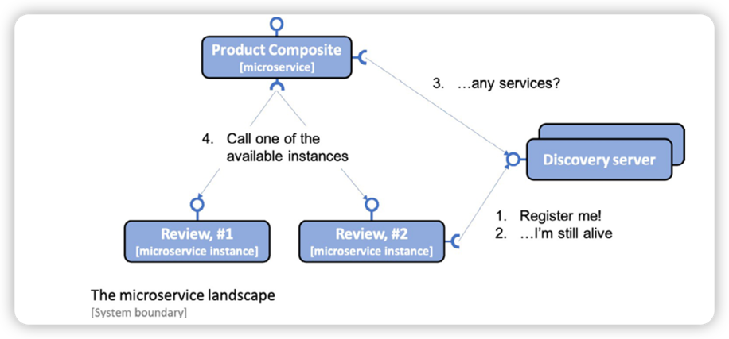

# Service Discovery 



Spring Cloud comes with an abstraction of how to communicate with a discovery service such as Netflix Eureka and provides 
an interface called `DiscoveryClient`. This can be used to interact with a discovery service get information regarding 
available services and instances. Implementation of the `DiscoveryClient` interface are also capable of automatically 
registering a Spring Boot application with the discovery server.

Spring Boot can find the implementations of the `DiscoveryClient` interface automatically during startup, so we only need to 
bring in a dependency on the corresponding implementation to connect to a discovery server. In the case of Netflix Eureka, 
the dependency that's used by our microservice is `spring-cloud-starter-netflix-eureka-client`.


## Setting up Netflix Eureka server 

1. Create a new Spring Boot project 
2. Add a dependency to `spring-cloud-starter-netflix-eureka-server`
3. Add annotation `@EnableEurekaServer`
4. Add a Dockerfile
5. Add the eureka server to Docker Compose files.

## Setting up Eureka Clients 

```groovy
// Add dependency to each microservice 
Implementation 'org.springframework.cloud:spring-cloud-starter-netflix-eureka-client'
```

```java
// Disable the use of Eureka in spring boot tests
@SpringBootTest(webEnvironment=RANDOM_PORT, properties = {"eureka.client.enabled=false"})
```

Also, you need to specify the application name in yaml file, and replace the hardcoded url with the `http:/applicaiton_name`.

## Eureka Parameters 

* Parameters for the Eureka server, prefixed with `eureka.server`
* Parameters for Eureka clients, prefixed with `eureka.client`. This is for clients who want to communicate with a Eureka server
* Parameters for Eureka instances, prefixed with `eureka.instance`. This is for the microservices instances that want to register themselves in the Eureka server.

[Eureka Reference](https://docs.spring.io/spring-cloud-netflix/docs/current/reference/html/)


```yaml
# Configuration for clients connect to Eureka server.
app.eureka-server: localhost

eureka:
  client:
    serviceUrl:
      defaultZone: http://${app.eureka-server}:8761/eureka/
    initialInstanceInfoReplicationIntervalSeconds: 5
    registryFetchIntervalSeconds: 5
  instance:
    leaseRenewalIntervalInSeconds: 5
    leaseExpirationDurationInSeconds: 5
```

```shell
# trying out the discovery service 
./gradlew clean build && docker-compose build && ./test-em-all.bash start

# scale up the review service
docker-compose up -d --scale review=3

# validate review service status 
docker-compose logs review | grep Started

# scale down the review service 
docker-compose up -d --scale review=2

# stop Eureka server and keep two review services 
docker-compose up -d --scale review=2 --sacle eureka=0

# Terminate ond of the two review instances 
docker-compose up -d --scale review=1 --scale eureka=0

# Start new instance of the product service 
docker-compose up -d --scale review=1 --scale eureka=0 --scale product=2

# Start the eureka server 
docker-compose up -d --scale review=1 --scale eureka=1 --scale product=2

# bring down the docker containers 
docker-compose down 
```


