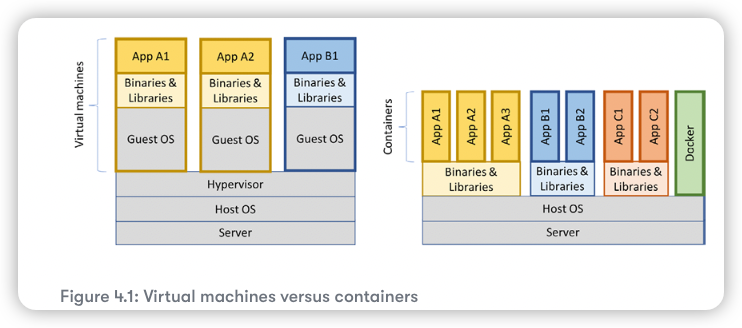

# Deploying Spring Boot microservice with Docekr 

Objective:
* Introduction to Docker 
* Docker and Java. 
* Using Docker with one microservice 
* Managing a landscape of microservice using Docker Compose
* Automating tests of cooperating microservices

## Introduction to Docker

Docker made the concept of containers as a lightweight alternative to virtual 
machines very popular in 2013. To quickly recap: containers are actually processed
in a Linux host that uses Linux **namesapces** to provide isolation between containers,
and Linux Control Groups (**cgroups**) are used to limit the amount of CPU and memory
that a container is allowed to consume.

Compared to a virtual machine that uses a hypervisor to run a complete copy of an operating
system in each virtual machine, the overhead in a container is a fraction of the overhead in a 
virtual machine. This leads to much faster startup times and a significantly lower footprint.
Containers are, however, not considered to be as secure as virtual machines. 




## Docker commands 

```shell
# -it option indicates that we can interact with the container using Terminal 
# --rm option tells Docker to remove the container once we exit the Terminal session.
docker run -it --rm ubuntu

# list all containers(including stopped, running)
docker ps -a

# docker rm -f : stops and removes the containers whose container IDs are specified
# docker ps -aq: lists the containers IDs of all the running and stopped containers
# -q option reduces the output from the "docker ps" command so that it only lists the IDs
docker rm -f $(docker ps -aq)
```

## Challenges with running Java in Docker 

Over the past few years, there have been a number of attempts to get Java working in Docker 
in a good way. Most importantly, Java hasn't historically been very good at respecting limits 
set for Docker containers when it comes to the use of memory and CPU.

In Java SE 9, initial support for container-based CPU and memory constrains was provided, much 
improved in Java SE 10.

We will use Java SE 16 as example to see how it responses to limits we set on a container it runs in.

```shell
# Limiting available CPUs
# run the `jshell` in a container using the Docker image that contains JDK 16
# send the Java statement `Runtime.getRuntime().availableprocessors()` to jshell
echo 'Runtime.getRuntime().availableProcessors()' | docker run --rm -i adoptopenjdk:16 jshell -q

# --cpus 3 -> restrict the Docker container to only be allowed to use three CPU cores
echo 'Runtime.getRuntime().availableProcessors()' | docker run --rm -i --cpus=3 adoptopenjdk:16 jshell -q

# Limiting available memory 
# -XX:+PrintFlagsFinal -> ask JVM for extra runtime information 
docker run -it --rm adoptopenjdk:16 java -XX:+PrintFlagsFinal | grep "size_t MaxHeapSize"

# Set JVM memory constrains
# By default, Java will allocate one-quarter of the memory available to the container for its heap
# -m=1024M -> a Docker option, set the memory up to 1 GB
docker run -it --rm -m=1024M adoptopenjdk:16 java -XX:+PrintFlagsFinal | grep "size_t MaxHeapSize"

# Set max heap size on the JVM 
# -Xmx600m -> set JVM heap size to 600 MB
docker run -it --rm -m=1024M adoptopenjdk:16 java -Xmx600m -XX:+PrintFlagsFinal -version | grep "size_t MaxHeapSize"

# OOM reported, because it exceed the maximum heap size 
echo 'new byte[500_000_000]' | docker run -i --rm -m=1024M adoptopenjdk:16 jshell -q

```

## Using Docker with one microservice

The whole build process(gradle + docker) would be: 

1. define Docker file 
2. define docker profile in application.yaml 
3. build command: gradle clean build && docker build -t [service-name]  .

To run microservice in a Docker container, we need to package it in a Docker image. 
To build a Docker image, we need a Dockerfile.

Since a microservice that runs in a container is isolated from other microservices - it has 
its own IP address, hostname, and ports - it needs a different configuration compared to 
when it's running on the same host with other microservices.

For example, since the other microservices no longer run on the same host, 
no port conflicts will occur. When running in Docker, we can use the default 
port 8080 for all our microservices without any risk of port conflicts. 
On the other hand, if we need to talk to the other microservices, 
we can no longer use localhost like we could when we ran them on the same host.

__The source code in the microservices will not be affected by running the microservices in containers, only their configuration__

[Spring boot with docker](https://spring.io/guides/topicals/spring-boot-docker/)

```dockerfile
# To handle the extraction of the far-jar file in Dockerfile, we use a multi-stage build.
# The first step is named "builder", that handles the extraction.
# The second stage builds the actual Docker image that will be used at runtime,
# packing the files as required from the first stage.
# Using this technique, we can handle all packing logic in the Dockerfile but at the same time
# keep the size of the final Docker image to a minimum.


# This is first stage, named "builder".
FROM adoptopenjdk:16_36-jre-hotspot as builder 
# set working directory to "extracted"
WORKDIR extracted
# Add fat-jar file from the Gradle build library to working direcotry
ADD ./build/libs/*.jar app.jar
# Perform the extraction of the far-jar file into its working directory, the extracted folder.
RUN java -Djarmode=layertools -jar app.jar extract

# final stage
FROM adoptopenjdk:16_36-jre-hotspot
WORKDIR application
# copy the exploded files from the builder stage, folder by folder, into the "application" folder
# --from=builder is used to instruct Docker to pick the files from the file system in the builder stage.
COPY --from=builder extracted/dependencies/ ./
COPY --from=builder extracted/spring-boot-loader/ ./
COPY --from=builder extracted/snapshot-dependencies/ ./
COPY --from=builder extracted/application/ ./

# expose port: 8080
EXPOSE 8080
# command to tell Docker what java class to run to start the microservice
ENTRYPOINT ["java", "org.springframework.boot.loader.JarLauncher"]
```

```shell
# command to build the Docker image；
# 1. we need to build our deployment artifact first
./gradlew clean build
# 2. build the Docker image, here product-service as example
# Docker will use the Dockerfile in the current directory to build the Docker image.
# The image will be tagged with the name "product-service" and stored locally inside the Docker engine
docker build -t product-service .

# verify images
docker image | grep product-service

# Start up the service 
# --rm option: tell Docker to clean up the container once we stop the execution 
# -p8080:8080: maps port 8080 in the container to port 8080 in the Docker host.
# -e option: specify environment variables for the container, SPRING_PROFILES_ACTIVE=docker
# is to tell Spring what profiles to use.
docker run --rm -p8080:8080 -e "SPRING_PROFILES_ACTIVE=docker" product-service

# Run the container detached
# --name : give a name to container
docker run -d -p8080:8080 -e "SPRING_PROFILES_ACTIVE=docker" --name my-prd-srv product-service

# check the container logs
# -f opion: tells the command to follow the log output, that is, not end the command.
docker logs my-prd-srv -f 


# stop and remove the container
docker rm -f my-prd-srv
```

## Docker Compose - Managing Multiple microservices 

The purpose of docker-compose is that we can build, start, log, and stop a group of cooperating 
microservices in one command.

```yml
version: '2.1'
# For each microservice, we have:
# 1. name of the microservice
# 2. A build directive that specifies where to find the Dockerfile that was used to build the Docker image
# 3. A memory limit of 512MB
# 4. The environment variables that will be set up for the container.
services:
  product:
    build: microservices/product-service
    mem_limit: 512m
    environment:
      - SPRING_PROFILES_ACTIVE=docker

  recommendation:
    build: microservices/recommendation-service
    mem_limit: 512m
    environment:
      - SPRING_PROFILES_ACTIVE=docker

  review:
    build: microservices/review-service
    mem_limit: 512m
    environment:
      - SPRING_PROFILES_ACTIVE=docker

  product-composite:
    build: microservices/product-composite-service
    mem_limit: 512m
    ports:
      - "8080:8080"
    environment:
      - SPRING_PROFILES_ACTIVE=docker
```

```shell
# Start up the microservices
docker-compose up -d

# check the logs
docker-compose logs -f

# check logs for specify service 
docker-compose logs -f product review

# shutdown microservices 
docker-compose down

# restart a container 
docker-compose restart product 

# 
docker-compose up -d --scale product=1

# reclaim space: this can be used when Docker is running out of disk space
docker system prune -f --volumes

# single command to build artifact, image, and perform test
./gradlew clean build && docker-compose build && ./test-em-all.bash start stop

```