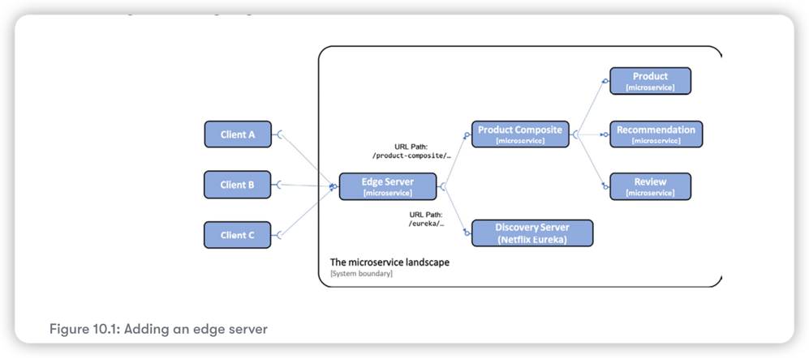

# Edge Server



We only expose Edge service for outside clients.


## Configuring Spring Cloud Gateway 

1. Since Spring Cloud gateway will use Eureka to find the microservices it will route traffic to, it must be configured as a Eureka client.
2. Configuring Spring Boot Actuator for development usage
3. Configure log levels so that we can see log messages from interesting parts of the internal processing in the Spring Cloud Gateway

```yaml
#Configuring Spring Boot Actuator for development usage
management.endpoint.health.show-details: "ALWAYS"
management.endpoints.web.exposure.include: "*"
# Configure log level 
logging:
  level:
    root: INFO
    org.springframework.cloud.gateway.route.RouteDefinitionRouteLocator: INFO
    org.springframework.cloud.gateway: TRACE

```

## Routing rules

Setting up routing rules can be done in two ways: programmatically, using a Java DSL, or by configuration. Using a Java DSL to 
set up routing rules programmatically can be useful in cases where the rules are stored in external storage, such as a database,
or are given at runtime, for example, via a RESTful API or a message sent to the gateway. In more static use cases, I find it 
more convenient to declare the routes in the configuration file. Separating the routing rules from the Java code makes it possible
to update the routing rules without having to deploy a new version of the microserice.

A route is defined by the following:

* **Predicates**, which select a route based on information in the incoming HTTP request
* **Filters**, which can modify both the request and/or the response 
* A **destination URI**, which describes where to send a request 
* An **ID**, that is, the name of the route

[spring gateway reference](https://cloud.spring.io/spring-cloud-gateway/reference/html/)


```yaml

spring.cloud.gateway.routes:
# route the incoming requests where the URl startwith `/product-composite/` to product-composite service
  - id: product-composite
# `lb://` is used to direct spring gateway to use the client-side load balancer to look up the destination in the discovery service.
    uri: lb://product-composite
#  to specify what requests this route should match, `**` matches zero or more elements in the path 
    predicates:
      - Path=/product-composite/**

  - id: product-composite-swagger-ui
    uri: lb://product-composite
    predicates:
      - Path=/openapi/**
  
  - id: eureka-api
    uri: https://${app.eureka-server}:8761
#    The `{segment}` in Path value matches zero or more elements in the path and will be used to replace the `{segment}` in SetPath
    predicates:
      - Path=/eureka/api/{segment}
    filters:
      - SetPath=/eureka/{segment}
    
  - id: eureka-web-start
    uri: http://${app.eureka-server}:8761
    predicates:
      - Path=/eureka/web
    filters:
      - SetPath=/

  - id: eureka-web-other
    uri: http://${app.eureka-server}:8761
    predicates:
      - Path=/eureka/**

# host based routing 


# To make calls to http://i.feel.lucky:8080/headerrouting return 200 OK
  - id: host_route_200
    uri: http://httpstat.us
    predicates:
      - Host=i.feel.lucky:8080
      - Path=/headerrouting/**
    filters:
      - SetPath=/200

# To make calls to http://im.a.teapot:8080/headerrouting return `418 I'm a teapot`
  - id: host_route_418
    uri: http://httpstat.us
    predicates:
      - Host=im.a.teapot:8080
      - Path=/headerrouting/**
    filters:
      - SetPath=/418
# To make calls to other hostnames, return `501 Not Implemented`
  - id: host_route_501
    uri: http://httpstat.us
    predicates:
      - Path=/headerrouting/**
    filters:
      - SetPath=/501

```

Topics to be explored:

* Examining what is exposed by the edge server outside of the system landscape running in the Docker engine
* Trying out some of the more frequently used routing rules as follows:
    * Use URL-based routing to call our APIs through the edge server
    * Use URL-based routing to call the Swagger UI through the edge server
    * Use URL-based routing to call Netflix Eureka through the edge server, both using its API and web-based UI
    * Use header-based routing to see how we can route requests based on the hostname in the request

```shell
# Start up containers
./gradlew clean build && docker-compose build && ./test-em-all.bahs start 

# inspect which ports are exposed by our services
docker-compose ps gateway eureka product-compose product recommendation review

# check what routes the edge server has set up
curl localhost:8080/actuator/gateway/routes -s | jq '.[] | {"\(.route_id)": "\(.uri)"}' | grep -v '{\|}'

# inspect logs for edge gateway service 
docker-compose logs -f --tail=0 gateway

# try out API
curl http://localhost:8080/product-composite/1

# Try out APi to see what instances are currently registered in the discovery server
curl -H "accept:application/json"\ 
localhost:8080/eureka/api/apps -s | \
jq -r .applications.application[].instance[].instanceId

# To call for the i.feel.lucky hostname
curl http://localhost:8080/headerrouting -H "Host: i.feel.lucky:8080"

# To call for im.a.teapot
curl http://localhost:8080/headerrouting -H "Host: im.a.teapot:8080"

# To call others, that's, will return 501 Not Implemented
curl http://localhost:8080/headerrouting


```