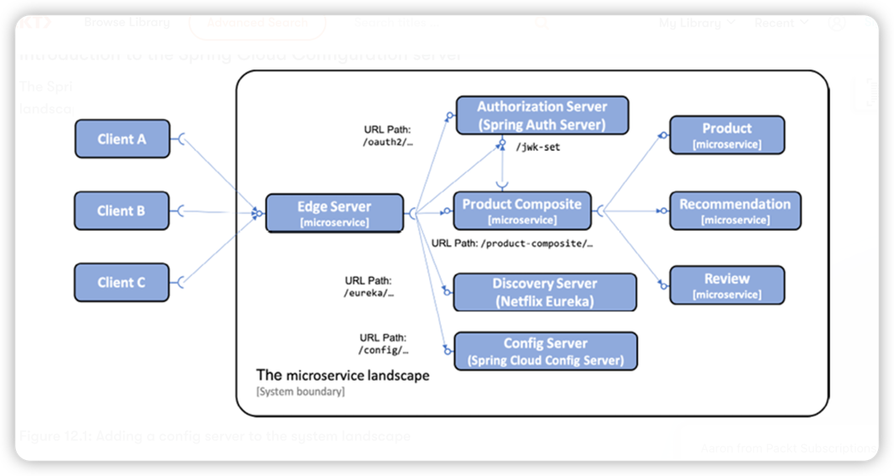

# Centralized Configuration 

Objective

* Introduction to the Spring Cloud Configuration server
* Setting up a config server
* Configuring clients of a config server
* Structuring the configuration repository 
* Trying out the Spring Cloud Configuration server

## Different type of storage of the configuration repository 

* Git repository 
* Local filesystem 
* HashiCorp Vault 
* JDBC database

In this project, we will use a local filesystem. To use the local filesystem, the config server needs to be launched with the Spring profile, `native`, enabled.
The location of the configuration repository is specified using the `spring.cloud.config.server.native.searchLocations` property.

## Securing the configuration in transit 
When the configuration information is asked for by a microservice, or anyone using the API of the config server, it will be protected against eavesdropping by the 
edge server since it already uses HTTPS.

To ensure that the API user is a known host, we will use HTTP Basic authentication. We can set up HTTP Basic authentication by using Spring Security in the config server
and specifying the environment variables, `SPRING_SECURITY_USER_NAME` and `SPRING_SECURITY_USER_PASSWORD` ， with the permitted credentials.

## Securing the configuration at rest

To avoid a situation where someone with access to the configuration repository can steal sensitive information, such as passwords, the config server 
supports the encryption of configuration information when stored on disk.

We're using symmetric key. The symmetric key is given to the config server at startup by specifying an environment variable, `ENCRYPT_KEY`. 

## Configuring clients of a config server

1. Add `spring-cloud-starter-config` and `spring-retry` dependencies to the Gradle build file 
2. Move the configuration file, `applicaiton.yml` to the config repository and rename it with the name of the client as specified by the property `spring.application.name`
3. Add a new `application.yml` file to the `src/main/resources` folder. This file will be used to hold the configuration required to connect to the config server.
4. Add credentials for accessing the config server to the Docker Compose files
5. Disable the use of the config server when running Spring Boot-based automated tests, by adding `spring.cloud.config.enabled=false`

