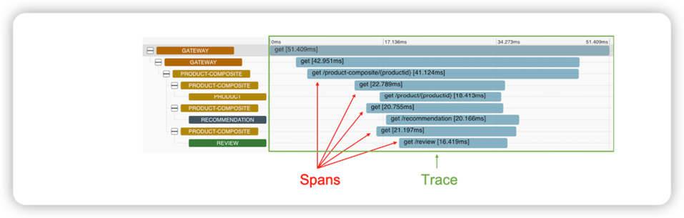
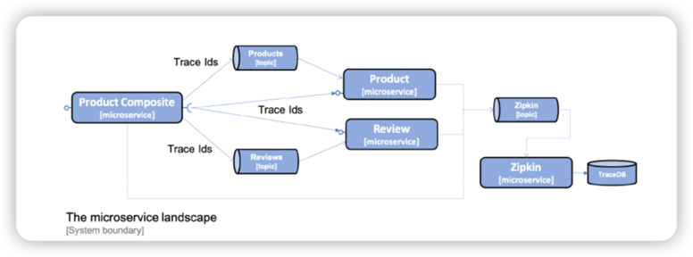

# Distributed Tracing 

Spring Cloud Sleuth will be used to collect trace information, and Zipkin will be used for the storage and visualization of said trace information.

Objective: 
* Introducing distributed tracing with Spring Cloud Sleuth and Zipkin
* How to add distributed tracing to the source code 
* How to perform distributed tracing, visualizing both successful and unsuccessful API requests. 
* How to use either RabbitMQ or Kafka to send trace events from our microservices to the Zipkin server





Spring Cloud Sleuth can send trace information to Zipkin either synchronously over HTTP, or asynchronously using message broker such as RabbitMQ or Kafka.
To avoid creating runtime dependencies on the Zipkin server from the microservices, it is preferable to send trace information to Zipkin asychronously 
using either RabbitMQ or Kafka.



Zipkin comes with native support for storing trace information either in memory, or in a database such as Apache Cassandra, elasticsearch, or MySQL.

## Implementation 

1. add dependencies to the build files to bring in Spring Cloud Sleuth and the capability of sending trace information to Zipkin
2. Add dependencies on RabbitMQ and Kafka for the projects that haven't used them before, that is, the Spring Cloud project `authorization-server`, `eureka-server`, and `gateway`
3. Configure the microservices to send trace information to Zipkin using either RabbitMQ or Kafka
4. Add a Zipkin server to the Docker Compose files
5. Add the `Kafka` Spring profile in `docker-compose-kafka.yml` to the Spring Cloud projects `authorization-server`, `eureka-server`, and `gateway`


To run the Zipkin server as a Docker container, we will use a Docker image published by the Zipkin project. Refer to https://hub.docker.com/r/openzipkin/zipkin for details.


### Add dependencies to build files

```groovy
implementation 'org.springframework.cloud:spring-cloud-starter-sleuth'
implementation 'org.springframework.cloud:spring-cloud-sleuth-zipkin'
```

For the Gradle projects that haven't used RabbitMQ and Kafka before, the following dependencies have also been added:

```groovy
implementation 'org.springframework.cloud:spring-cloud-starter-stream-rabbit'
implementation 'org.springframework.cloud:spring-cloud-starter-stream-kafka'
```

### Adding configuration for Spring Cloud Sleuth and Zipkin


```yml
#  config in common configuration file: config-repo/application.yml
spring.zipkin.sender.type: rabbit
# enable all traces are sent to Zipkin
spring.sleuth.sampler.probability: 1.0

# When sending traces to Zipkin using Kafka, the Spring profile `kafka` will be used.
---
spring.config.activate.on-profile: kafka
spring.zipkin.sender.type: kafka
```

```yml
# config-repo/gateway.yml

# enable Sleuth to track IDs correctly
spring.sleuth.reactor.instrumentation-type: decorate-on-last

```

### Add Zipkin to the Docker Compose files

```yml
#docker-compose.yml, docker-compose-partitions.yml
  zipkin:
    image: openzipkin/zipkin:2.23.2
    mem_limit: 1024m
    environment:
      - RABBIT_ADDRESSES=rabbitmq  # use RabbitMQ for Zipkin
      - STORAGE_TYPE=mem # trace information in memory
    ports: 
      - 9411:9411
    depends_on:
      rabbitmq:
        condition: service_healthy

# it's OK to store the trace information in Zipkin in memory for dev and test activities,
# Zipkin should be configured to store trace information in a database such as Apache Cassandra,
# Elasticsearch, or MySQL in a production environment
```


```yml
# docker-compose-kafka.yml, where Kafka is used, the definition of the Zipkin server appears as follows:
zipkin:
  image: openzipkin/zipkin:2.23.2
  mem_limit: 1024m
  environment:
    - STORAGE_TYPE=mem
    - KAFKA_BOOTSTRAP_SERVERS=kafka:9092
  ports:
    - 9411:9411
  depends_on:
    - kafka
  
# config to be added into `eureka`, `gateway`, `auth-server`
environment:
  - SPRING_PROFILES_ACTIVE=docker, kafka
```

We're all set. run the dockerable service to test your change!


