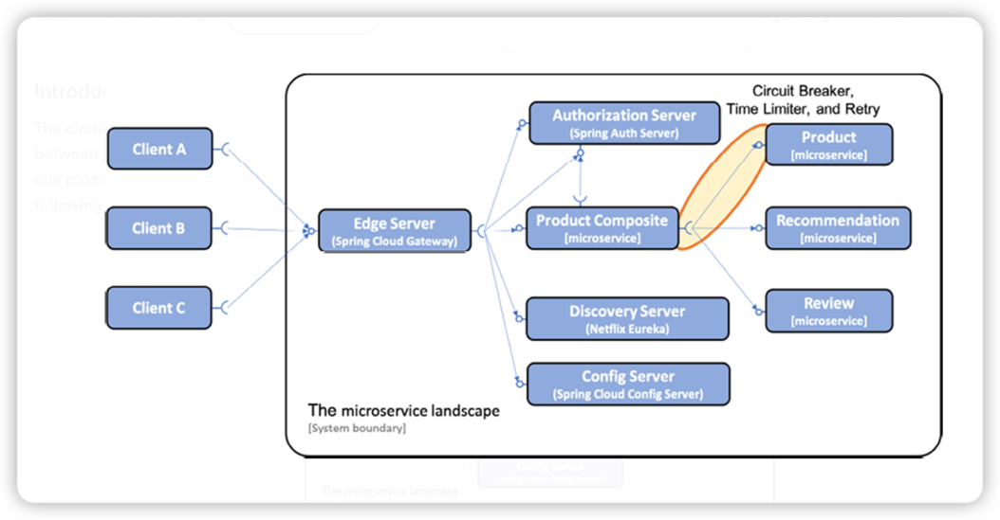
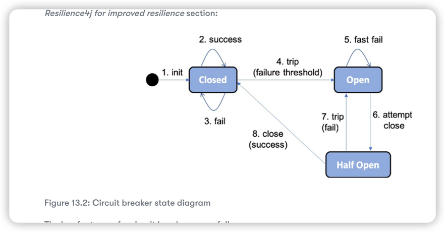

# Improving Resilience Using Resilience4j

We will see how the circuit breaker in Resilience4j can be used together with a time limiter and retry mechanism to prevent two of the most common error siutations:

* Microservices that start to response slowly or not at all
* Requests that randomly fail from time to time, for example, due to temporary network problems

The circuit breaker, time limiter, and retry mechanism are potentially useful in any synchronous communication between two software components.

## Introducing the circuit breaker 

Parameters to configure Resilience4j in our project:
* slidingWindowType
* slidingWindowSize
* failureRateThreshold
* automaticTransitionFromOpenToHalfOpenEnabled
* waitDurationInOpenState
* permittedNumberOfCallsInHalfOpenState
* ignoreExceptions
* registerHealthIndicator
* allowHealthIndicatorToFail
* management.health.circuitbreakers.enabled: true

[circuit breaker documentation](https://resilience4j.readme.io/docs/circuitbreaker#create-and-configure-a-circuitbreaker)

## Introducing the time limiter 

To help a circuit breaker handle slow or unresponsive services, a timeout mechanism can be helpful. Resilience4j's timeout mechanism, called a `Timelimiter`, can 
be configured using standard Spring Boot configuration files.

* timeoutDuration

## Introducing the retry mechanism 

The retry mechanism is very useful for random and infrequent faults, such as temporary network glitches. The retry mechanism can simply retry a failed request 
a number of times with a configurable delay between the attempts. One very important restriction on the use of the retry mechanism is that the services 
that it retries must be **idempotent**

* maxAttempts
* waitDuration
* retryExceptions

## Implementation 

* Add a starter dependency on Resilience4j in the build file 
* Add annotations in the source code where the resilience mechanisms will be applied 
* Add configuration that controls the behavior of the resilience mechanism

