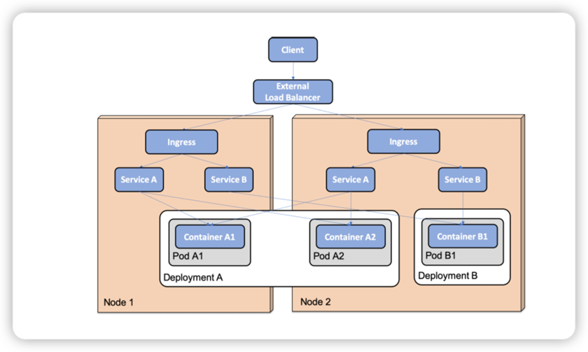
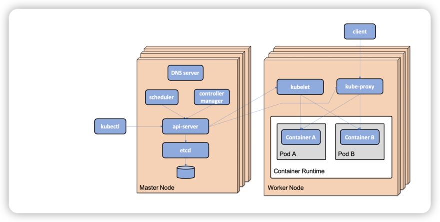

# Introduction to Kubernetes

Objective: 
* Introducing Kubernetes concepts 
* Introducing Kubernetes API objects
* Introducing Kubernetes runtime components 
* Creating a local Kubernetes cluster
* Trying out a sample deployment and getting used to the `kubectl` Kubernetes CLI tool
* Managing a local Kubernetes cluster


## Introducing Kubernetes concepts 

At a high level, as a container orchestrator, Kubernetes makes a cluster of (physical or virtual) servers that run container appear as one big logical server 
running containers. As a operator, we declare a **desired state** to the Kubernetes cluster by creating objects using the Kubernetes API. Kubernetes continuously
compares the desired state with the current state. If it detects differences, it takes action to ensure that the current state is the same as the desired state.

One of the main purposes of a Kubernetes cluster is to deploy and run containers, but also to support zero-downtime rolling upgrades using techniques such as 
green/blue and canary deployments. Kubernetes can schedule containers, that is, **Pods** that contain one or more co-located containers, to the available nodes
in the cluster.

To be able to monitor the health of running containers, Kubernetes assumes that containers implement a **liveness probe**. If a liveness prone reports an unhealthy
container, kubernetes will restart the container. 

Container can be scaled in the cluster manually or automatically using a horizontal auto-scaler. To optimize the use of the available hardware resources in a cluster,
for example, memory and CPU, containers can be configured with **quotas** that specify the amount of resources a container needs. On the other hand, limits regarding 
how much a container is allowed to consume can be specified on the Pod or for a group of Pods on the **namespace** level.


Another main purpose of Kubernetes is to provide service discovery of the running Pods and their containers. Kubernetes **Service** objects can be defined for service 
discovery and will also load balance incoming requests over the available Pods. Service objects can be exposed to the outside of a Kubernetes cluster. However,
as we will see, an **Ingress** object is, in many cases, better suited to handling externally incoming traffic to a group of services.  To help Kubernetes find out whether 
a container is ready to accept incoming requests, a container can implement a **readiness probe**.

Internally, a Kubernetes cluster provides one big flat IP network where each Pod gets its own IP address and can reach all the other Pods, independent of which node they run one.


## Introducing Kubernetes API objects

Kubernetes defines an API that is used to manage different types of objects or resources, as they are also known. 

* **Node**: A node represents a server, virtual or physical, in the cluster
* **Pod**: A Pod represents the smallest possible deployable component in Kubernetes, consisting of one more co-located containers.
  * The containers share the same IP address and port range. This means that containers in the same Pod instance can talk to each other over localhost, but need to be aware of potential port collisions.
* **Deployment**: A Deployment is used to deploy and upgrade Pods. The Deployment objects hand over the responsibility of creating and monitoring the Pods to a ReplicaSet.
  * When creating a Deployment for the first time, the work performed by the Deployment object is not much more than creating the ReplicaSet object. 
  * When performing a rolling upgrade of a Deployment, the role of the Deployment object is more involved.
* **ReplicaSet**: A ReplicaSet is used to ensure that a specified number of Pods are running at all times. If A Pod is deleted, it will be replaced with a new Pod by the ReplicaSet.
* **Service**: A Service is a stable network endpoint that you can use to connect to one or multiple Pods.
  * A Service is assigned an IP address and a DNS name in the internal network of the Kubernetes cluster
* **Ingress**: Ingress can manage external access to Service in a Kubernetes cluster, typically using HTTP or HTTPS. 
* **Namespace**: A namespace is used to group and, on some levels, isolate resources in a Kubernetes cluster.
  * The names of resources must be unique in their namespaces, but not between namespaces
* **ConfigMap**: A ConfigMap is used to store configuration that's used by containers. ConfigMaps can be mapped into a running container as environment variables or files.
* **Secret**: THis is used to store sensitive data used by containers, such as credentials. Secrets must be available to containers in the same way as ConfigMaps.
* **DaemonSet**: This ensures that one Pod is running on each node in a set of nodes in the cluster.





## Introducing Kubernetes runtime components

A Kubernetes cluster containers two types of nodes: **master nodes** and **worker nodes**. Master nodes manage the cluster, while the main purpose of worker nodes is to run the actual workload, for example,
the containers we deploy in the cluster. 

Kubernetes is built up by a number of runtime components. The most important components are as follows:



* **api-server**: the entry point to the control plane. This exposes a RESTful API, which, for example, the Kubernetes CLI tool known as **kubectl** uses.
* **etcd**, a highly available and distributed key/value store, used as a database for all cluster data.
* A **Controller manager**, which contains a number of controllers that continuously evaluate the desired state versus the current state for the object defined in the etcd database.
  * Whenever the desired or current state changes, a controller that's responsible for that type of state takes actions to move the current state to the desired state.
* A **scheduler**, which is responsible for assigning newly created Pods to a node with available capacity, for example, in terms of memory and CPU. 
  * **Affinity rules** can be used to control how Pods are assigned to nodes. 
    *  For example, Pods that perform a lot of disk I/O operations can be assigned to a group of worker nodes that have fast SSD disks. 
  * **Anti-affinity rules** can be defined to separate Pods, for example, to avoid scheduling Pods from the same Deployment to the same worker node.


Components that run on all the nodes, constituting the **data plane**:

* **kubelet**, a node agent that executes as a process directly in the nodes' operating system and not as container. 
  * A kubelet ensures that the Pods that are scheduled to its node have their containers up and running and that they are healthy.
  * It acts as a conduit between the api-server and the container runtime on its node
* **kube-proxy**: a network proxy that enables the Service concept in Kubernetes and is capable of forwarding requests to the appropriate Pods, typically in a round-robin fashion if more than one Pod is available for the specific Service. kube-proxy is deployed as a daemonSet.
* **Container runtime**: which is the software that runs the containers on a node. Historically, Kubernetes used Docker, but today any implementation of the Kubernetes **Container Runtime Interface(CRI)** can be used.


## Working with MiniKube profiles

```shell
# specify profile
minikube profile my-profile

# get current profile 
minikube config get profile

# list profiles 
minikube profile list 


```

## Working with the Kubernetes CLI, kubectl 

```shell

kubectl apply 

kubectl delete 

kubectl create namespace

# shows info about a specific API object
kubectl get 

# give more detail about a specific API object
kubectl describe 

# display log output from container 
kubectl logs 

# list the available contexts
kubectl config get-contexts

# switch context
kubectl config use-context my-cluster

# change namespace to my-namespace
kubectl config set-context $(kubectl config current-context) --namespace my-namespace

# get current context
kubectl config current-context

# build a Kubernetes cluster
unset KUBECONFIG
minikube start \
 --profile=handson-spring-boot-cloud \
 --memory=10240 \
 --cpus=4 \
 --disk-size=30g \
 --kubernetes-version=v1.20.5 \
 --driver=hyperkit

minikube profile handson-spring-boot-cloud

minikube addons enable ingress
minikube addons enable metrics-server


```


