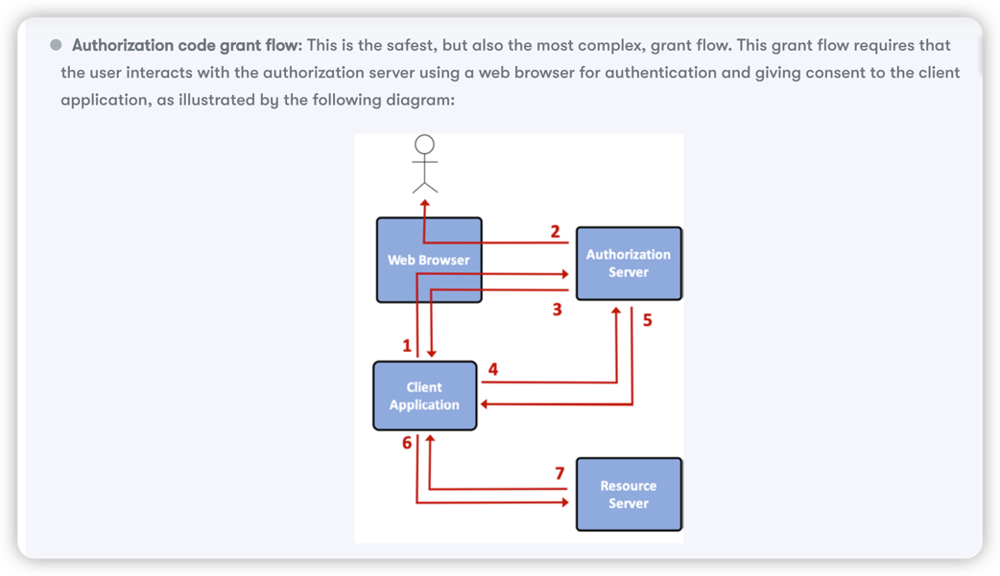
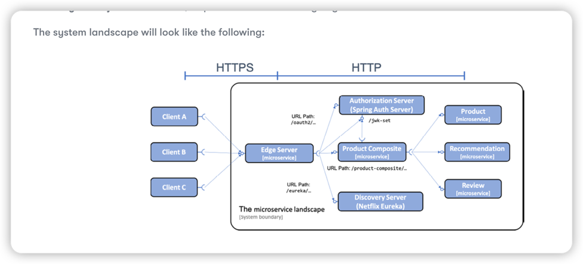

# Securing Access to APIs

Objective:

* An introduction to the Oauth 2.0 and OpenID Connect standards
* A general discussion on how to secure the system landscape 
* Protecting external communication with HTTPS 
* Securing access to the discovery server, Netflix Eureka
* Adding a local authorization server to our system landscape
* Authenticating and authorizing API access using OAuth 2.0 and OpenID Connect
* Testing with the local authorization server
* Testing with an external OpenID Connect provider, Auth0


## Introduction to OAuth 2.0 and OpenID Connect 

Authentication means identifying a user by validating credentials supplied by the user, as a username and password.

Authorization is about giving access to various parts of, in our case, an API to an authenticated user.

OAuth 2.0 is an open standard for authorization delegation, and OpenID Connect is an add-on to OAuth 2.0 that enables 
client applications to verify the identify of users based on the authentication performed by the authorization server.


### Introducing OAuth 2.0

OAuth 2.0 is a widely accepted open standard for authorization that a user to give consent for a third-party client application
to access protected resources in the name of the user. Giving a third-party client application the right to act in the name of a user,
for example, calling an API, is known as authorization delegation.


Concepts:

* Resource owner: The end user
* Client: The third-party client application, for example, a web app or a native mobile app, that wants to call some protected APIs in the name of the user
* Resource server: The server that exposes the APIs that we want to protect
* Authorization server: The authorization server issues tokens to the client after the resource owner, that is, the end user, has been authenticated. The management of user information and the authentication of users are typically delegated behind the scenes, to an **Identity Provider(IdP)**.

* access token: it's issued by an authorization server that gives the client application limited access to a selected set of APIs in the name of the user
* refresh token: it's also issued by an authorization server to a client application, it can be used by the client application to obtain new access token without having to involve the user


OAuth 2.0 specification authorization grant flows for access token:


1. The client application initiates the grant flow by sending the user to the authorization server in the web broswer
2. The authorization server will authenticate the user and ask for the user's consent 
3. The authorization server will redirect the user back to the client application with an authorization code.
   1. The authorization server will use a redirect URI specified by the client in the step 1 to know where to send the authorization code
   2. Given the authorization code is passed back to the client application using the web browser, that is, to an unsecure environment, so it's only allowed to be used once and and only during a short time period.
4. To exchange the authorization code for an access token, the client application is expected to call the authorization server again. 
5. The authorization server issues an access token and sends back to the client application. The authorization server can also, optionally, issue and return a refresh token
6. Using the access token, the client can send a request to the protected API exposed by the resource server
7. The resource server validates the access token and serves the request in the event of a successful validation.
   1. The step 6 and step 7 can be repeated, as long as the access token is valid.
   2. When the lifetime of the access token has expired, the client can use their refresh token to acquire a new access token

The other grant flows, more details please go through the OAuth documentation

* Implicit grant flow
* Resource owner password credentials grant flow
* Client credentials grant flow

[OAuth specification](https://datatracker.ietf.org/doc/html/rfc6749)
[Additional reading to explore various aspects of OAuth 2.0](https://www.oauth.com/oauth2-servers/map-oauth-2-0-specs/)


### Introducing OpenID Connect

OpenID Connect(abbreviated to OIDC) is an add-on to OAuth 2.0 that enables client applications to verify the identity of users. OIDC adds an extra toekn, 
an ID token, that the client application gets back from the authorization server after a completed grant flow.

The ID token is encoded as a JSON Web Token(JWT) and contains a number of claims, such as the ID and email address of the user.


## Implementation 

To secure the system landscape, we will:
1. Encrypt external requests and responses to and from our external API using HTTPs to protect against eavesdropping
2. Authenticate and authorize users and client application that access our APIs using OAuth 2.0 and OpenID Connect
3. Secure access to the discovery server, Netflix Eureka, using HTTP basic authentication

We will only apply HTTPS for external communication to our edge server, using plain HTTP for communication inside our system landscape.


For test purposes, we will add a local OAuth 2.0 authorization server to our system landscape. All external communication with the authorization
server will be routed through the edge server. The edge server and the `product-composite` service will act as OAuth 2.0 resource servers; that is,
they will require a valid OAuth 2.0 access token to allow access.



1. HTTPS is used for external communication, while plain text HTTP is used inside the system landscape
2. The local OAuth 2.0 authorization server will be accessed externally through the edge server
3. Both the edge server and the `product-composite` microservices will validate access tokens as signed JWTs
4. The edge server and `product-composite` microservice will get the authorization server's public keys from its `jwt-set` endpoint and use them to validate the signature of the JWT-based access tokens.


### Protecting external communication with HTTPS 

We will use HTTPS to encrypt communication. To use HTTPS, we need to do the following:

* Create a certificate: we will create our own self-signed certificate, sufficient for development purposes.
* Configure the edge server: It has to be configured to accept only HTTPS-based external traffic using the certificate

```shell
# generate self-signed certificate
keytool -genkeypair -alias localhost -keyalg RSA -keysize 2048 -storetype PKCS12 -keystore edge.p12 -validity 3650
```

The certificate file created, `edge.p12`, is placed in the `gateway` projects folder, `src/main/resources/keystore`. This 
means that the certificate file will be placed in the `.jar` file when it is built and will be available on the classpath at runtime at `keystore/edge.p12`.


To configure the edge server to use the certificate and HTTPS, the following is added to `application.yml` in the gateway project

```yaml
server.port: 8443

server.ssl:
 key-store-type: PKCS12
 key-store: classpath:keystore/edge.p12
 key-store-password: password
 key-alias: localhost

```
In addition to these changes in the edge server, changes are also required in the following file to replace HTTP to HTTPS

* Docker-compose file 
* test-em-all.bash

### Replacing a self-signed certificate at runtime 

Placing a self-signed certificate in the .jar file is only useful for development. For a working solution in runtime environments, 
for example, for test or production, it must be possible to use certificates signed by authorized CAs (short for Certificate Authorities).

when using Docker, the Docker image that contains the .jar file. When using Docker Compose to 
manage the Docker container, we can map a volume in the Docker container to a certificate 
that resides on the Docker host. We can also set up environment variables for the Docker 
container that points to the external certificate in the Docker volume.

To replace the certificate packaged in the .jar file, perform the following steps:

```shell
# Create a second certificate and set password to testtest
mkdir keystore
keytool -genkeypair -alias localhost -keyalg RSA -keysize 2048 -storetype PKCS12 -keystore keystore/edge-test.p12 -validity 3650


```


```yaml
# 
gateway:
  environment:
    - SPRING_PROFILES_ACTIVE=docker
    - SERVER_SSL_KEY_STORE=file:/keystore/edge-test.p12
    - SERVER_SSL_KEY_STORE_PASSWORD=testtest
  volumes:
    - $PWD/keystore:/keystore
  build: spring-cloud/gateway
  mem_limit: 512m
  ports:
    - "8443:8443"

```

### Securing access to the discovery server 

Now we will use HTTP Basic authentication to restrict access to the APIs and web pages on the discovery server,
Netflix Eureka. This means that we will require a user to supply a username and password to get access. Changes 
are required both on the Eureka server and in the Eureka clients.

Changes in the Eureka server

```groovy
implementation 'org.springframework.boot:spring-boot-starter-security'
```

```java
@Configuration
public SecurityConfig {
@Autowired
public SecurityConfig(
@Value("${app.eureka-username}") String username,
@Value("${app.eureka-password}") String password
        ) {
        this.username = username;
        this.password = password;
        }

        
public void configure(AuthenticationManagerBuilder auth) throws Exception {
        auth.inMemoryAuthentication()
        .passwordEncoder(NoOpPasswordEncoder.getInstance())
        .withUser(username).password(password)
        .authorities("USER");
        }

}

protected void configure(HttpSecurity http) throws Exception {
        http
        .authorizeRequests()
        .anyRequest().authenticated()
        .and()
        .httpBasic();
        }

```

```yaml
# credential 
app:
 eureka-username: u
 eureka-password: p
```

```java
// change in unit test
@Value("${app.eureka-username}")
private String username;
 
@Value("${app.eureka-password}")
private String password;
 
@Autowired
public void setTestRestTemplate(TestRestTemplate testRestTemplate) {
   this.testRestTemplate = testRestTemplate.withBasicAuth(username, password);
}

```

Changes in Eureka clients


```yaml
app:
  eureka-username: u
  eureka-password: p

# the credentials can be specified in the connection URL for the Eureka server.
eureka:
  client:
     serviceUrl:
       defaultZone: "http://${app.eureka-username}:${app.eureka-
                     password}@${app.eureka-server}:8761/eureka/"
```


### Adding a local authorization server 

To be able to run tests locally and fully automated with APIs that are secured using 
OAuth 2.0 and OpenID Connect, we will add an authorization server that is compliant with 
these specifications to our system landscape.

[Spring Authorization Server](https://spring.io/blog/2020/04/15/announcing-the-spring-authorization-server)

The Spring Authorization Server supports both the use of the OpenID Connect discovery 
endpoint and digital signing of access tokens. It also provides an endpoint that can be 
accessed using the discovery information to get keys for verifying the digital signature of 
a token.

See the code in project `authorization-server`


### Protecting APIs using OAuth 2.0 and OpenID Connect

With the authorization server in place, we can enhance the edge server and the product-composite service to become OAuth 2.0 resource servers, so that they will require a valid access token to allow access. The edge server will be configured to accept any access token it can validate using the digital signature provided by the authorization server. The product-composite service will also require the access token to contain valid OAuth 2.0 scopes:

* The `product:read` scope will be required for accessing the read-only APIs
* The `product:write` scope will be required for accessing the create and delete APIs

The `product-composite` service will also be enhanced with configuration that allows its Swagger UI 
component to interact with the authorization server to issue an access token. 

## Testing 

```shell
./gradlew clean build && docker-compose build && ./test-em-all.bash start

curl -H "accept:application/json" https://u:p@localhost:8443/eureka/api/apps -ks | jq -r .applications.application[].instance[].instanceId
```