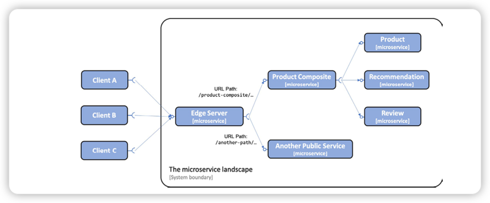
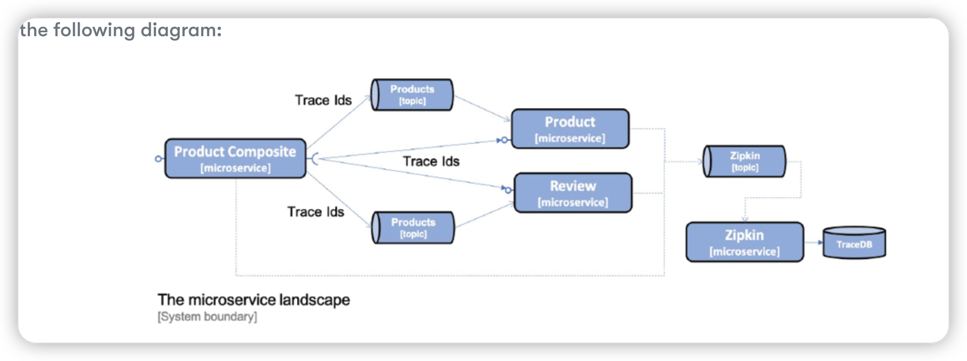

# Introduction to Spring cloud 

* Service discovery -> Netflix Eureka and Spring Cloud LoadBalancer
* Edge server -> Spring Cloud Gateway and Spring Security OAuth 
* Centralized configuration -> Spring Cloud Configuration Server 
* Circuit breaker -> Resilience4j 
* Distributed tracing -> Spring Cloud Sleuth and Zipkin 

## Spring Cloud Config 

Spring Cloud Config supports storing configuration files in a number of different backends, like:
* A Git repository 
* local file system 
* HashiCorp Vault 
* A JDBC database

## Resilience4J for improved resilience 

* **Circuit breaker** is used to prevent a chain of failure reaction if a remote service stops responding 
* **Rate limiter** is used to limit the number of requests to a service during a specified time period 
* **Bulkhead** is used to limit the number of concurrent requests to a service 
* **Retries** are used to handle random errors that might happen from time to time 
* **Time limiter** is used to avoid waiting to long for a response from a slow or not responding service

[Resilience4j repo](https://github.com/resilience4j/resilience4j)

## Spring Cloud Sleuth and Zipkin for distributed tracing 

